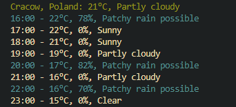

# WeatherCLI

WeatherCLI is a command-line tool written in Go that fetches and displays weather information for a specified city using the Weather API.

## Getting Started

To use WeatherCLI, you'll need an API key from Weather API. The application will prompt you to enter the API key when you run it for the first time. The key will be stored securely in a file on your system for subsequent use.

## Prerequisites

Make sure you have Go installed on your system.

## Installation

1. Clone this repository to your local machine:

    ```
    git clone https://github.com/MSSkowron/WeatherCLI.git
    ```

2. Change into the project directory:

    ```
    cd WeatherCLI
    ```

3. Build the application:

    ```
    go build -o weathercli
    ```

4. [Optional] Add the built binary to your /bin folder to have it accessible globally.
    For example, on Linux:
    
    ```
    mv weathercli /usr/local/bin
    ```

## Usage

If you have installed it globally:

```
weathercli <city_name>
```

Otherwise, in your current directory:

```
./weathercli <city_name>
```

If no city is provided as an argument, the default city will be set to "Cracow." If you wish to fetch weather information for a different city, specify the city name as an argument when running the command.

## API Key

The first time you run the WeatherCLI, it will prompt you to enter your Weather API key. If you already have an API key, you can enter it when prompted. The API key will be securely stored on your system for future use.

## Features

Display the current weather (temperature and condition) for the specified city.
Show the hourly forecast (temperature, chance of rain, and condition) for the rest of the current day.



## Build with

- Go - The programming language used.
- Weather API - The API used to fetch weather data.

## Acknowledgments

- Fatih Color (github.com/fatih/color) - A Go library for colorful terminal text output.

## License

The project is available as open source under the terms of the MIT License.
